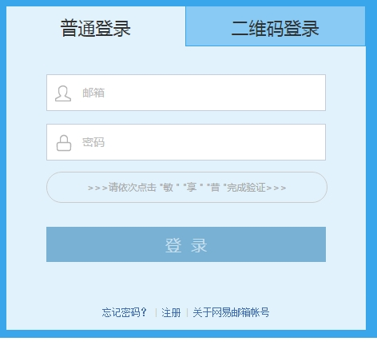

## 首先, 欢迎您加入远大信息互联网+团队

这是第一个课程，这个课程只是为了看一下你们的基础。随意地试着做一下下面的登录界面吧。

要求外观需要和图片基本一样，上方的“普通登录”和“二维码登录”可以点击切换，其他的地方不需要可以互动。

图标可以没有或者随便找一个图，可以用原生js，也可以使用jQuery来实现, CSS不要使用现成的UI库，兼容至IE8。

> /lib 目录下有一些公用的前端库

