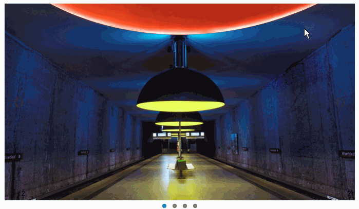

# 图片轮播

这次的课程会久一些，但是自己制作一次轮播图（也叫幻灯片，走马灯等等）功能会很有收获。  
效果如下图所示，几张图片会自动播放，鼠标放在图片上方时自动暂停播放，离开则继续自动播放，可以点击下方的控制点，也可以点击左右的方向箭头控制。

要求如下：
1. 基本功能：
  * 使用CSS和JS实现图片横向显示滚动效果，不得使用插件（jQuery本身除外）
  * JS计时自动播放，播放完最后一张图是自动回到第一张图
  * 增加左右箭头控制
  * 显示和响应下方控制点
  * 鼠标移入移出时，自动暂停/继续播放
2. 增强功能：
  * 轮播图是响应式的，和窗口宽度一致，高度自动调整
  * 适配至IE8
  * 抽取为插件，相关参数（如播放时间等）都是可以传入可配置的
