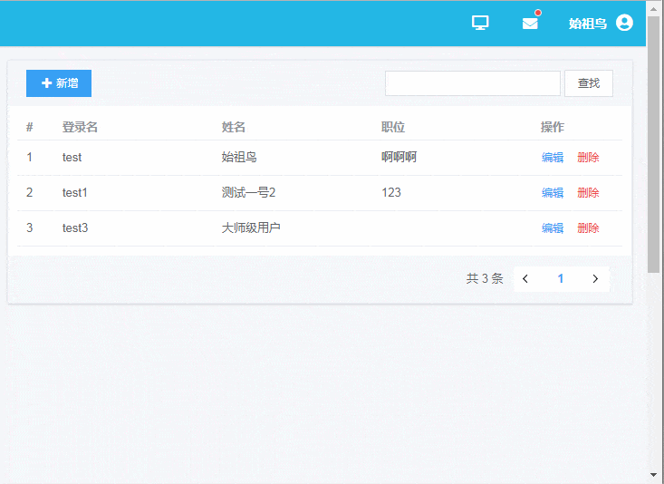

# VUE增删改查界面

通过这次的课程，我们会进一步掌握Vue的各种功能，并且深入组件、事件等各个方面，同时熟悉使用一些第三方库为之后的实际工作准备。

要求如下：
1. 基本功能：
  * 使用ElementUI，熟悉其中所有组件的基本情况，选用合适的组件制作如图效果界面；
  * 使用vue-cli新建项目，使用air-bnb验证规则，并使用附件的.eslintrc替换；
  * 参考[Vue界面指南](/lesson/08/vue-crud-standards.md)布置代码；
2. 增强功能：
  * 在实现基本功能后，使用VueRouter和Vuex，制作一个首页和本页面，可以点击跳转页面查看详情；
  * 在实现上面所有功能后，使用localeStorage存储用户编辑的信息；
